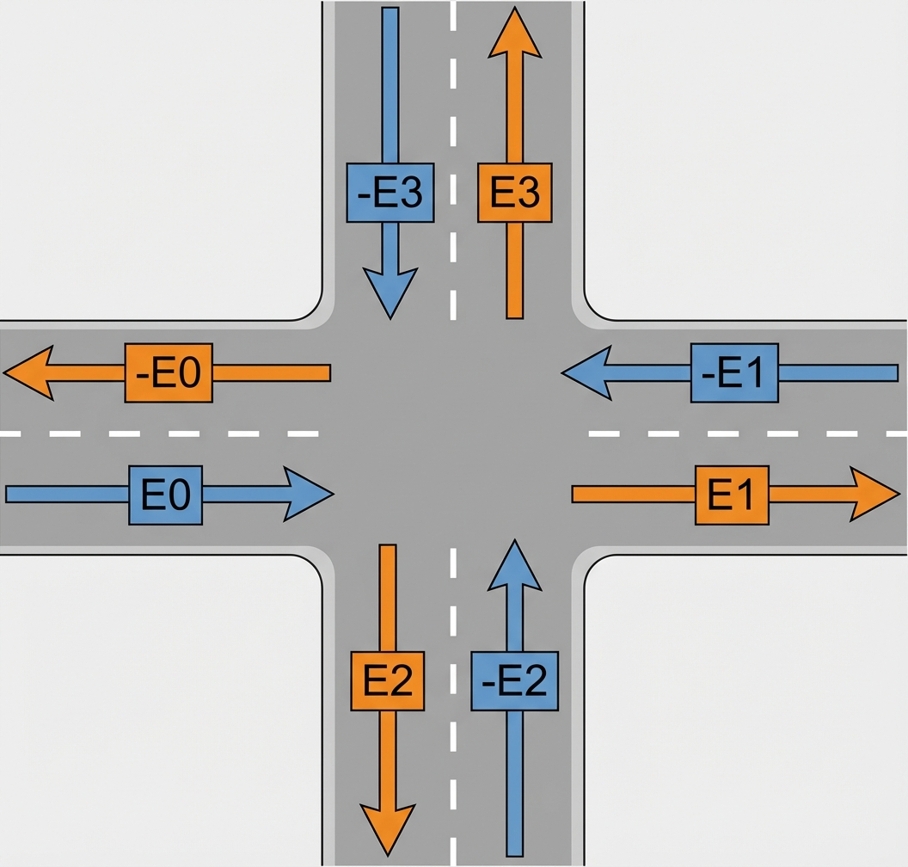

<!--
 * @Author: WANG Maonan
 * @Date: 2026-01-10 17:05:12
 * @Description: 使用 TranssimHub 完成单路口信号灯控制的例子
 * @LastEditTime: 2026-02-27 13:40:37
-->
# 利用 TransSimHub 完成单智能体信号灯控制

- exp_junction 包含实验的环境

这里的实验路网使用一个四路口的例子，如下图所示：

关于路网说明，所有的 lane 需要右键，将 road straight

## 基于 World Model 的决策

使用 diffusion transformer 来预测